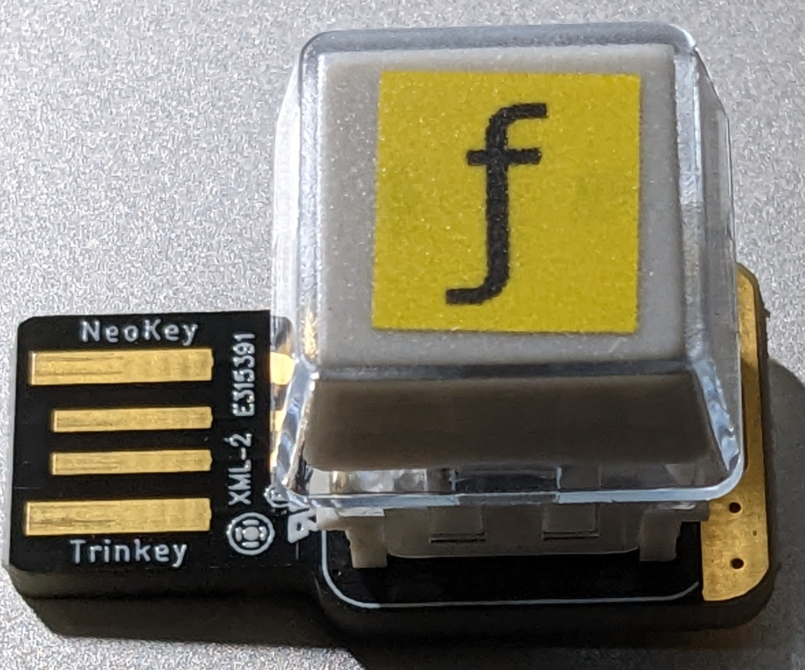

### ƒ-key

Flux job IDs in
[F58 encoding](https://flux-framework.readthedocs.io/projects/flux-rfc/en/latest/spec_19.html)
are prefixed with ƒ (U+0192).  Answers to questions like "How do I type an ƒ?"
as well as reasons why you shouldn't need to are
[available](https://flux-framework.readthedocs.io/en/latest/faqs.html#what-s-with-the-fancy-f),
but what if you just want to celebrate the Fluxish ƒ by adding an ƒ key to
your keyboard?  Look no further.

#### Hardware

This project adapts hardware and software from [Adafruit](https://adafruit.com)
to construct a USB ƒ key that sticks right out of the USB port on your laptop.
We need the following parts:
- [Neokey Trinkey](https://www.adafruit.com/product/5020)
- [MX compatible key switch](https://www.adafruit.com/product/5124)
- [relegendable key cap](https://www.adafruit.com/product/5039)
- ƒ image to go under the keycap such as a sticky tape label printed with [gLabels](https://help.gnome.org/users/glabels/stable/)

#### Firmware

Adafruit did all the work for us!
- Install [CircuitPython](https://learn.adafruit.com/adafruit-neokey-trinkey/circuitpython)
- Install [HID and Cap Touch Example](https://learn.adafruit.com/adafruit-neokey-trinkey/hid-and-cap-touch-example)
- Copy modified `code.py` onto mounted CIRCUITPY file system

The provided `code.py` works with gnome terminal.  Change the `key_output`
variable if you wish to have it generate a key sequence for another environment.

#### License

SPDX-License-Identifier: MIT
